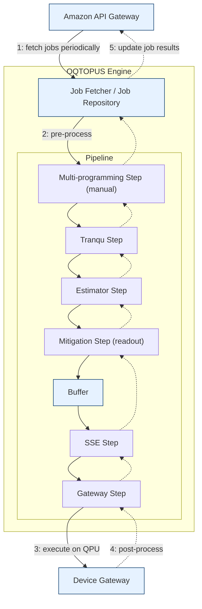

# Concept

This document provides a conceptual overview of the pipeline framework inside the OQTOPUS Engine.  
It describes the job-processing model, the role of steps and buffers, the two-phase execution flow, and how split/join semantics enable tree-structured job execution.

## 1. Pipeline Framework Overview

A pipeline is defined as an ordered list of **steps** and **buffers**.  
Each **job** enters the pipeline and moves through these elements under the control of the `PipelineExecutor`.

The executor separates the *definition* of the pipeline (a list of elements) from its *execution* (the asynchronous orchestration of job movement).

Conceptually:

- A **Step** transforms a job or its context.
- A **Buffer** queues jobs.
- The pipeline performs processing in two directions:
  - **pre-process phase** (forward traversal)
  - **post-process phase** (backward traversal)

During execution, the pipeline may create a **tree of jobs** via split/join semantics.  
This allows a single parent job to be split into multiple children jobs and later joined back again.

Each Step is layered like a stack, allowing natural composition of what used to be pre-process and post-process functionalities.



This pipeline architecture resembles the structure of a network protocol stack.

- Downstream (sending): additional information is added as data flows from upper to lower layers
- Upstream (receiving): additional information is removed as data flows from lower to upper layers

Similarly, OQTOPUS Engine can be understood as follows:

| Network Protocol Processing | OQTOPUS Engine Processing |
| -------------------------- | -------------------- |
| downstream (sending)       | pre-process          |
| upstream (receiving)         | post-process         |

Additionally, pre-process/post-process functions receive the following three arguments.
This separation allows context information and the job entity to be handled appropriately.

- **Global Context (`gctx`)**  
  Holds information shared across the entire pipeline (e.g., device information). Steps refer to this information, but **are not expected to modify it**.
- **Job Context (`jctx`)**  
  Holds information shared across steps during processing of the same job. **Modification by steps is expected**, and it is used when steps require dependencies within the pipeline.
- **Job**  
  The job entity to be processed. steps update this object to perform various operations such as transpilation.

## 2. Two-Phase Execution Model

### 2.1 pre-process Phase (Forward Traversal)

- The executor starts at the first element.
- For each step, it calls the step’s `pre_process()` method.
- When encountering a buffer:
  - the job is enqueued into the buffer;
  - the forward traversal stops;
  - the buffer's worker will later resume the job from the next element.

### 2.2 post-process Phase (Backward Traversal)

- The executor starts from the last element.
- For each step, it calls the step’s `post_process()` method.
- Buffers are skipped during backward traversal.

Backward traversal typically begins after:

- a job reaches the end of the pipeline, or
- a parent job is resumed after its children have been joined.

## 3. Buffers

A buffer:

- separates asynchronous execution between steps;
- starts a dedicated worker task when the executor begins;
- stores enqueued jobs from pre-process traversal;
- pops a job and resumes its execution from after the buffer.

Buffers participate **only** in the pre-process phase.  
They do not act during post-process traversal.

This design allows pipelined and concurrent processing using multiple workers.

## 4. Job Tree and Split/Join Semantics

### 4.1 Job Tree Structure

A job may be split into multiple child jobs:

- `job.children` contains the list of generated child jobs.
- Each child automatically receives `job.parent`.
- Job contexts (`JobContext`) mirror the same parent/child relationships.

This forms a **job tree**, where:

- the root job represents the original request;
- intermediate nodes represent branch points;
- leaves represent independently executed sub-jobs.

### 4.2 Split Semantics

A step may create child jobs during either:

- the pre-process phase (SplitOnPreprocess), or
- the post-process phase (SplitOnPostprocess).

When splitting:

- the parent job’s pipeline execution pauses;
- each child job starts its own pipeline execution from the beginning.

The parent will not resume until all children complete and a join occurs.

### 4.3 Join Semantics

A join step waits for all child jobs to complete.  
When the **last** child reaches the join step:

- the executor calls the join step’s `join_jobs()` method exactly once;
- the parent job is resumed in the same phase (pre-process or post-process) where the join step resides;
- all children are released after joining.

Join steps enable aggregation of results, multi-programming flows, and complex orchestration styles.

## 5. Parallelization

The pipeline framework enables parallel execution at two levels:

### 5.1 Concurrency via Buffers

Each buffer has its own worker task.  
Jobs placed in different buffers can be processed concurrently because each worker executes downstream steps independently.

This enables pipeline-level parallelism even without job splitting.

### 5.2 Concurrency via Split Steps

Split steps spawn multiple child jobs.  
Each child job executes:

- its own forward traversal,
- its own buffer scheduling,
- its own backward traversal.

All child pipelines run concurrently under the executor.

### 5.3 Synchronization via Join Steps

Join steps re-synchronize the execution:

- child jobs run independently and may finish at different times;
- the last child to reach the join step triggers the aggregation logic;
- only after join completion does the parent job resume execution.

This model provides structured parallelism similar to fork/join patterns in classical workflow engines.

## 6. Fetcher

Some processes must run periodically and autonomously, separate from the pipeline itself.
OQTOPUS Engine implements these operations as asynchronous fetchers.

### 6.1 Job Fetcher

OQTOPUS Engine periodically communicates with external systems to retrieve jobs.
For example, it may fetch jobs via the OQTOPUS Cloud API.

Job retrieval timing is controlled based on buffer capacity:
if the buffer contains sufficient pending jobs, retrieval is paused; when the buffer level drops, it resumes.

### 6.2 Device Fetcher

OQTOPUS Engine periodically communicates with external systems to fetch device information,
for example through the Device Gateway interface, for use by the transpiler and other components.

## 7. Dependency Injection

External interfaces such as fetchers may need to be swapped depending on the execution environment.

To support this, OQTOPUS Engine employs lightweight Dependency Injection (DI) using [Hydra](https://hydra.cc/) and [OmegaConf](https://omegaconf.readthedocs.io/).

For example, to replace the job fetcher with a custom module, you can specify the following configuration:

```yaml
job_fetcher:
  _target_: oqtopus_engine_core.fetcher.OqtopusCloudJobFetcher
  url: "http://localhost:8888"
  api_token: ""
  interval_seconds: 10
  limits: 10
```

Running the following code instantiates the class specified in `_target_` with the provided arguments:

```python
job_fetcher: JobFetcher = instantiate(gctx.config["job_fetcher"])
```

## 8. Exception Handling

The executor wraps each step call with a safe execution wrapper:

- Exceptions in a step are logged with contextual information.
- Errors in a child job prevent the corresponding parent job from resuming.
- A failing child does not trigger a join, and the parent job’s pipeline does not continue past the join step.

The system guarantees that exceptions are surfaced and that step-level failures do not silently break pipeline consistency.

## 9. Summary

The OQTOPUS Engine pipeline framework provides:

- clear phase separation (pre-process / post-process);
- asynchronous and buffer-driven execution;
- structured parallelism via split/join semantics;
- explicit job tree modeling;
- predictable synchronization points via join steps.

This design enables complex processing scenarios such as multi-programming, batching, post-processing aggregation, and multi-path execution in a controlled and extensible manner.
