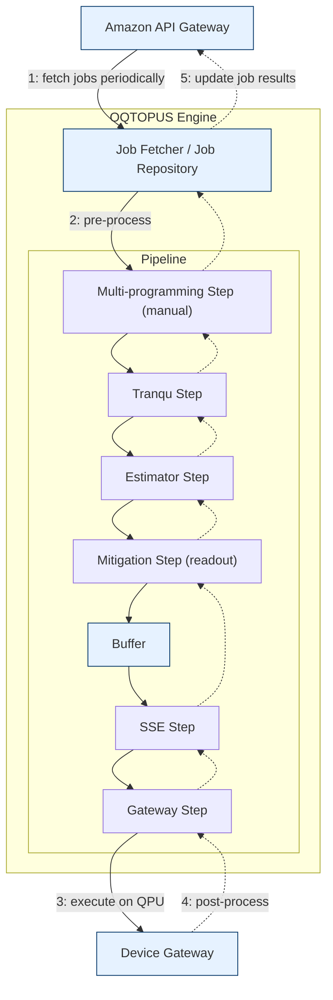

# Concept

This page explains the design concepts of OQTOPUS Engine and the architecture that supports them.

## Pipeline Framework

In earlier versions, we implemented functions that performed pre-process and post-process operations directly on Job objects.
As the number of tasks—such as sampling, expectation-value estimation, transpilation, and error mitigation—increased, the design became more complex, and the need for flexible composition grew.
Anticipating further increases in functionality, OQTOPUS Engine adopts the following pipeline architecture:

- Jobs are treated as entities that hold data.
- Each function (e.g., transpilation) is defined as a Step, which is applied in sequence.
- By passing a Job entity through these Steps, the desired processing is achieved.

Each Step is layered like a stack, allowing natural composition of what used to be pre-process and post-process functionalities.



This pipeline architecture resembles the structure of a network protocol stack.

- Downstream (sending): additional information is added as data flows from upper to lower layers
- Upstream (receiving): additional information is removed as data flows from lower to upper layers

Similarly, OQTOPUS Engine can be understood as follows:

| Network Protocol Processing | OQTOPUS Engine Processing |
| -------------------------- | -------------------- |
| downstream (sending)       | pre-process          |
| upstream (receiving)         | post-process         |

Additionally, pre-process/post-process functions receive the following three arguments.
This separation allows context information and the job entity to be handled appropriately.

- **Global Context (`gctx`)**  
  Holds information shared across the entire pipeline (e.g., device information). Steps refer to this information, but **are not expected to modify it**.

- **Job Context (`jctx`)**  
  Holds information shared across Steps during processing of the same job. **Modification by Steps is expected**, and it is used when Steps require dependencies within the pipeline.

- **Job**  
  The job entity to be processed. Steps update this object to perform various operations such as transpilation.

## Buffer

To avoid resource conflicts on the quantum processor, jobs are temporarily stored in a buffer and processed sequentially when execution resources become available.

Pipeline Steps are categorized as:

- **Before Buffer Steps**: Steps that perform pre-processing before a job is inserted into the buffer
- **After Buffer Steps**: Steps that perform pre-processing after a job is removed from the buffer and before execution on the quantum processor

The buffer is used only for pre-processing and is not involved in post-processing.

## Parallelization

OQTOPUS Engine executes each job’s pipeline processing as an asynchronous coroutine using `async` / `await`.
This enables efficient parallel execution of I/O-bound tasks.

However, Python’s GIL (Global Interpreter Lock) makes it difficult to fully utilize multiple CPU cores.
Therefore, for CPU-bound operations, additional mechanisms such as multi-process execution may be required.

## Fetcher

Some processes must run periodically and autonomously, separate from the pipeline itself.
OQTOPUS Engine implements these operations as asynchronous fetchers.

### Job Fetcher

OQTOPUS Engine periodically communicates with external systems to retrieve jobs.
For example, it may fetch jobs via the OQTOPUS Cloud API.

Job retrieval timing is controlled based on buffer capacity:
if the buffer contains sufficient pending jobs, retrieval is paused; when the buffer level drops, it resumes.

### Device Fetcher

OQTOPUS Engine periodically communicates with external systems to fetch device information,
for example through the Device Gateway interface, for use by the transpiler and other components.

## Dependency Injection

External interfaces such as fetchers may need to be swapped depending on the execution environment.

To support this, OQTOPUS Engine employs lightweight Dependency Injection (DI) using [Hydra](https://hydra.cc/) and [OmegaConf](https://omegaconf.readthedocs.io/).

For example, to replace the job fetcher with a custom module, you can specify the following configuration:

```yaml
job_fetcher:
  _target_: oqtopus_engine_core.fetcher.OqtopusCloudJobFetcher
  url: "http://localhost:8888"
  api_token: ""
  interval_seconds: 10
  limits: 10
```

Running the following code instantiates the class specified in `_target_` with the provided arguments:

```python
job_fetcher: JobFetcher = instantiate(gctx.config["job_fetcher"])
```

## Exception Handling in the Framework

If an exception occurs during a Step’s pre-process or post-process and the developer does not handle it, the exception may propagate upward.
Even in such cases, OQTOPUS Engine is designed so that the entire process does not crash.

The framework catches unhandled exceptions, safely marks the job as `failed`, and logs detailed information so the root cause can be investigated later.
