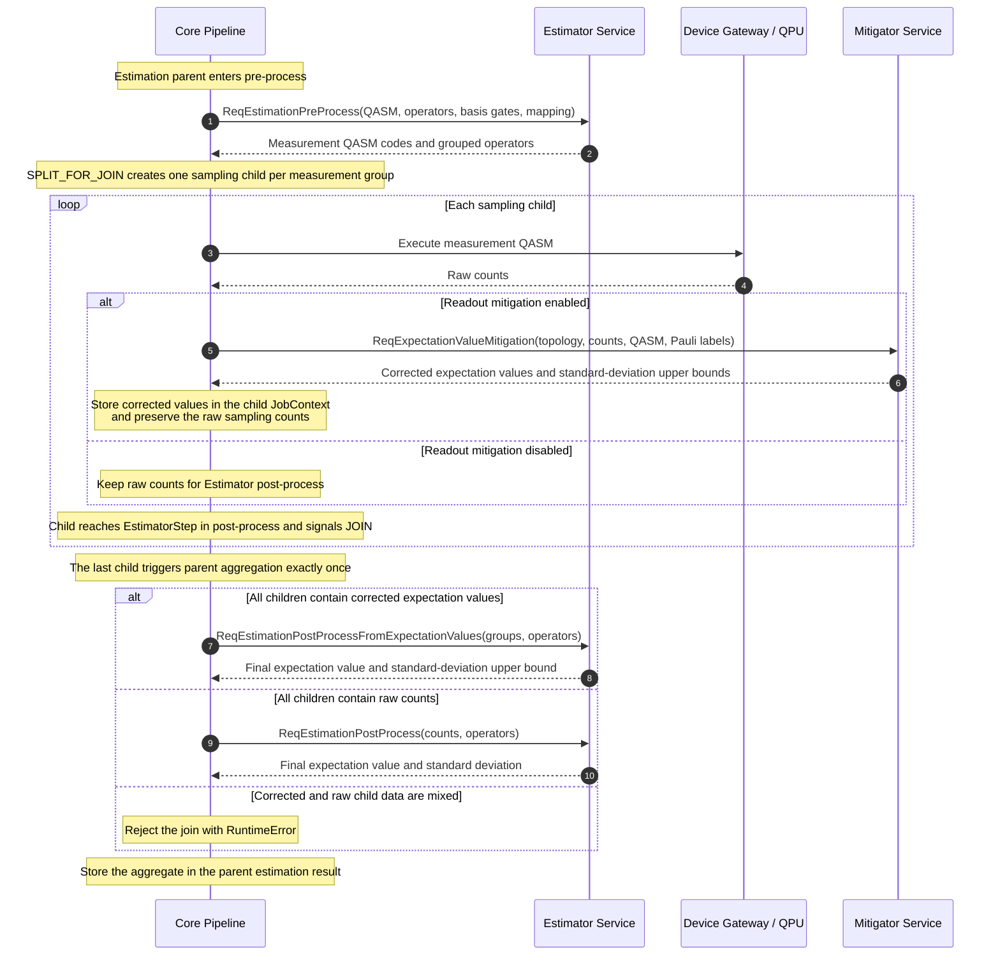

# Estimation Readout Mitigation

This document describes how OQTOPUS Engine applies local readout-error
mitigation (REM) directly to expectation values for estimation jobs. It covers
the pipeline split/join flow, service responsibilities, gRPC contracts, and
deployment compatibility.

For the common calibration model, see
[Readout Error Mitigation](./overview.md). For the estimation flow without
mitigation-specific details, see [Estimation](../../estimation/overview.md).

## 1. Design Goals

Estimation and sampling use readout mitigation differently:

- A sampling job needs mitigated integer counts as its result.
- An estimation job needs corrected expectation values for Pauli operators.

The two operations therefore use separate RPCs and messages. This avoids using
optional fields to change the meaning of an existing request or response and
prevents a caller from accidentally mixing raw counts with corrected
expectation values.

For estimation, REM is applied to each measurement-group child before the
Estimator service combines the groups. The direct path avoids projecting a
corrected quasi-probability distribution back to integer counts, which would
discard precision before expectation-value aggregation.

## 2. Service Responsibilities

| Component | Responsibility |
| --- | --- |
| Core `EstimatorStep` | Requests measurement circuits, splits an estimation parent into sampling children, and joins their results. |
| Device Gateway and QPU | Execute each measurement circuit and return raw counts. |
| Core `ReadoutErrorMitigationStep` | Selects expectation-value REM from child Pauli metadata and stores corrected child data. |
| Mitigator service | Builds a local readout mitigator from device assignment errors and computes corrected Pauli expectation values. |
| Estimator service | Creates grouped measurement circuits and aggregates corrected expectation-value groups. |

## 3. Processing Sequence

The post-process phase traverses pipeline steps in reverse order. Consequently,
each sampling child reaches `ReadoutErrorMitigationStep` before it reaches the
join point in `EstimatorStep`.

## 4. Detailed Flow

### 4.1 Estimation Pre-process and Split

1. Core sends the estimation QASM, observable, basis gates, and qubit mapping to
   `ReqEstimationPreProcess`.
2. The Estimator service groups compatible Pauli terms and generates one
   measurement circuit for each group.
3. Core stores the grouped Pauli labels and coefficients as parent join
   metadata.
4. Core creates a sampling child for each measurement circuit with
   `SPLIT_FOR_JOIN`.
5. Each child context records its group index and Pauli labels. The children run
   independently through the same pipeline.

### 4.2 Child Execution and Direct REM

After the Device Gateway returns raw counts, `ReadoutErrorMitigationStep` checks
the child's mitigation configuration and Pauli metadata.

When local readout mitigation is enabled for an estimation child:

1. Core builds `ReqExpectationValueMitigationRequest` from the device readout
   assignment errors, raw counts, measurement QASM, and Pauli labels.
2. The Mitigator service reconstructs the measured-qubit and classical-bit
   layout from the QASM program.
3. It creates one assignment matrix per measured qubit from `p0m1` and `p1m0`.
4. It evaluates each Pauli expectation value directly with the local readout
   mitigator. The optimized contraction uses a greedy `einsum` path.
5. It returns one corrected expectation value and one standard-deviation upper
   bound per Pauli label.
6. Core validates that the Pauli labels, expectation values, and uncertainty
   bounds have equal lengths, then stores them in the child `JobContext`.

The raw counts remain attached to the sampling child, but the corrected join
path does not send them to the Estimator service.

### 4.3 Parent Join and Aggregation

The final child to reach `EstimatorStep` triggers `join_jobs()`. Core restores
the original measurement-group order before constructing the aggregation
request.

Core chooses exactly one aggregation contract:

- If every child context contains corrected expectation values and uncertainty
  bounds, Core calls `ReqEstimationPostProcessFromExpectationValues`.
- If no child context contains corrected expectation values, Core calls the
  existing counts-based `ReqEstimationPostProcess`.
- If only some children contain corrected values, Core raises `RuntimeError`
  instead of silently combining data with different semantics.
- A corrected child must contain both expectation values and
  standard-deviation upper bounds. A context containing only one is invalid.

For corrected values $E_i$, coefficients $c_i$, and standard-deviation upper
bounds $B_i$, the Estimator service computes:

$$
E_{\mathrm{parent}} = \sum_i c_i E_i
$$

and propagates the conservative uncertainty bound as:

$$
B_{\mathrm{parent}} = \sum_i \lvert c_i \rvert B_i.
$$

Core writes the aggregated expectation value and uncertainty to the parent
estimation result.

## 5. External Library Use

| Operation | Owner |
| --- | --- |
| Parse each measurement OpenQASM 3 program | Qiskit `qasm3.loads()`, backed by `qiskit-qasm3-import` |
| Represent observed counts | Qiskit `Counts` |
| Invert local assignment matrices and normalize count vectors | Qiskit Experiments `LocalReadoutMitigator` and `counts_probability_vector()` |
| Calculate the standard-deviation upper bound | Qiskit Experiments `LocalReadoutMitigator.stddev_upper_bound()` |
| Contract observable coefficients with inverse assignment matrices | OQTOPUS `_OptimizedLocalReadoutMitigator`, using NumPy `einsum(..., optimize="greedy")` |
| Select Pauli support, handle identity terms, validate child data, and aggregate groups | OQTOPUS Mitigator, Core, and Estimator services |

OQTOPUS subclasses Qiskit Experiments' `LocalReadoutMitigator`; it does not
replace the complete external algorithm. The subclass reimplements the
expectation-value contraction to select a greedy NumPy contraction path while
retaining the external library's assignment-matrix inversion, count-vector
conversion, and uncertainty-bound calculation. External dependency declarations
are linked from the
[common REM overview](./overview.md#6-implementation-ownership-and-external-dependencies).

## 6. gRPC Contracts

| Service | RPC | Input semantics | Output semantics |
| --- | --- | --- | --- |
| Mitigator | `ReqExpectationValueMitigation` | Raw counts and Pauli labels for one estimation measurement group | Corrected expectation values and standard-deviation upper bounds |
| Estimator | `ReqEstimationPostProcessFromExpectationValues` | Corrected expectation-value groups, uncertainty bounds, and grouped operators | Aggregated expectation value and standard-deviation upper bound |

The source definitions are maintained in:

- [Estimator interface](../../../../spec/estimator_interface/oqtopus_engine_core/interfaces/estimator_interface/v1/estimator.proto)
- [Mitigator interface](../../../../spec/mitigator_interface/oqtopus_engine_core/interfaces/mitigator_interface/v1/mitigator.proto)

Generated protobuf and gRPC modules must not be edited manually.

## 7. Validation and Limits

- The OpenQASM 3 program must parse successfully.
- Pauli labels must have equal width and contain only `I`, `X`, `Y`, or `Z`.
- The selected measurement-destination count must match the Pauli-label width.
- The Mitigator response must contain one expectation value and one uncertainty
   bound per Pauli label.
- Every child in a join must provide either corrected values and bounds or raw
   counts; mixed child semantics are rejected.
- The shared limit is 32 measured qubits. Identity-only terms return
   expectation value 1 and uncertainty bound 0.

## 8. Deployment Compatibility

The expectation-value methods are new gRPC methods. A new Core calling an older
Estimator or Mitigator server receives gRPC `UNIMPLEMENTED` because the older
server does not register those methods.

Use the following rollout order:

1. Deploy the Mitigator service with `ReqExpectationValueMitigation`.
2. Deploy the Estimator service with
   `ReqEstimationPostProcessFromExpectationValues`.
3. Deploy Core after both service methods are available.

For rollback, reverse the order: roll back Core first, then the Estimator and
Mitigator services. The existing counts-based RPCs remain available for normal
sampling jobs and estimation jobs without REM.
