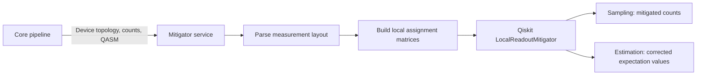

# Readout Error Mitigation

Local readout-error mitigation corrects measurement assignment errors using
per-qubit calibration data. This page describes the model shared by the
sampling and estimation result paths.

## 1. Configuration and Pipeline Placement

A job enables local REM by setting `mitigation_info.ro_error_mitigation` to
`pseudo_inverse`. Jobs without a configured readout-mitigation method pass
through unchanged.

`ReadoutErrorMitigationStep` performs no pre-process operation. It runs during
post-process, after a device has returned measurement counts. The step handles
these cases:

- A normal `sampling` job uses the counts path.
- A `multi_manual` job uses the counts path for its combined sampling result.
  During reverse post-process traversal, REM runs before `MultiManualStep`
  divides that result into per-program counts.
- An internal sampling child created by `EstimatorStep` contains Pauli metadata
  in its `JobContext` and uses the expectation-value path.

## 2. Result Paths

Sampling and estimation consume measurement results differently:

| Result path | Input | Output | Detailed flow |
| --- | --- | --- | --- |
| Sampling | Raw counts | Mitigated integer counts | [Sampling REM](./sampling.md) |
| Estimation | Raw counts and Pauli labels | Corrected expectation values and standard-deviation upper bounds | [Estimation REM](./estimation.md) |

Core owns orchestration and determines which result contract is required. The
Mitigator service owns numerical mitigation and exposes separate RPCs:

| RPC | Purpose |
| --- | --- |
| `ReqMitigation` | Convert raw counts into mitigated integer counts for sampling results. |
| `ReqExpectationValueMitigation` | Compute corrected Pauli expectation values directly from raw counts. |

Keeping the RPCs separate prevents optional request fields from changing the
meaning of an existing operation. It also allows Core to validate that an
estimation join contains only corrected expectation values or only raw counts.

## 3. Assignment-Error Model

For each measured qubit, OQTOPUS Engine reads these values from device
information:

- `p0m1`: probability of measuring 1 after preparing 0
- `p1m0`: probability of measuring 0 after preparing 1

The Mitigator service constructs the assignment matrix

$$
A =
\begin{bmatrix}
1 - p0m1 & p1m0 \\
p0m1 & 1 - p1m0
\end{bmatrix}.
$$

It passes one matrix per measured qubit to Qiskit Experiments'
`LocalReadoutMitigator`. The current implementation assumes local, independent
assignment errors rather than a correlated full-device assignment matrix.

## 4. Measurement Layout

The Mitigator service parses the OpenQASM 3 program to recover the relationship
between measured qubits and classical bits. This is necessary because count
bit-string order does not by itself identify the physical qubit associated with
each bit.

The selected layout records:

- physical qubit indices in classical-bit order
- classical-bit indices used by the mitigation operation
- the total number of classical memory slots

For estimation children, the number of selected measurement destinations must
match the Pauli-label width. For sampling, all measured destinations are used.

## 5. Shared Processing

The result paths diverge after creation of the local mitigator:

- [Sampling REM](./sampling.md) computes quasi-probabilities, projects them to
  the nearest probability distribution, and converts that distribution to
  integer counts.
- [Estimation REM](./estimation.md) evaluates Pauli expectation values directly
  and preserves floating-point correction precision.

## 6. Implementation Ownership and External Dependencies

The numerical REM implementation depends on external libraries. The Mitigator
service declares these dependencies in
[mitigator/pyproject.toml](../../../../mitigator/pyproject.toml).

| Package | Responsibility in local REM |
| --- | --- |
| Qiskit | Provides OpenQASM 3 loading, count containers, and quasi-distribution projection APIs. |
| Qiskit Experiments | Provides `LocalReadoutMitigator`, local assignment-matrix inversion, mitigated quasi-probabilities, count normalization helpers, and uncertainty-bound calculation. |
| qiskit-qasm3-import | Provides the importer used by Qiskit's `qasm3.loads()` for the executed program. |
| NumPy | Represents assignment matrices and performs the locally optimized expectation-value contraction. |

OQTOPUS owns the device-calibration mapping, measured-bit selection, RPC
routing, validation, sampling count conversion, Pauli-term handling, and
estimation-group aggregation. It subclasses Qiskit Experiments'
`LocalReadoutMitigator` only to optimize the expectation-value contraction;
the distinction is detailed in the Sampling and Estimation REM pages.

## 7. Validation and Limits

- The QASM program must parse successfully and contain enough measurement
  destinations for the requested operation.
- Pauli labels must have equal width and contain only `I`, `X`, `Y`, or `Z`.
- The current implementation limits mitigation to 32 measured qubits because
  probability vectors grow exponentially with the measured-qubit count.
- Identity-only Pauli terms return expectation value 1 and uncertainty bound 0.

## 8. Interfaces

The source contract is maintained in the
[Mitigator interface](../../../../spec/mitigator_interface/oqtopus_engine_core/interfaces/mitigator_interface/v1/mitigator.proto).
Generated protobuf and gRPC modules must not be edited manually.
