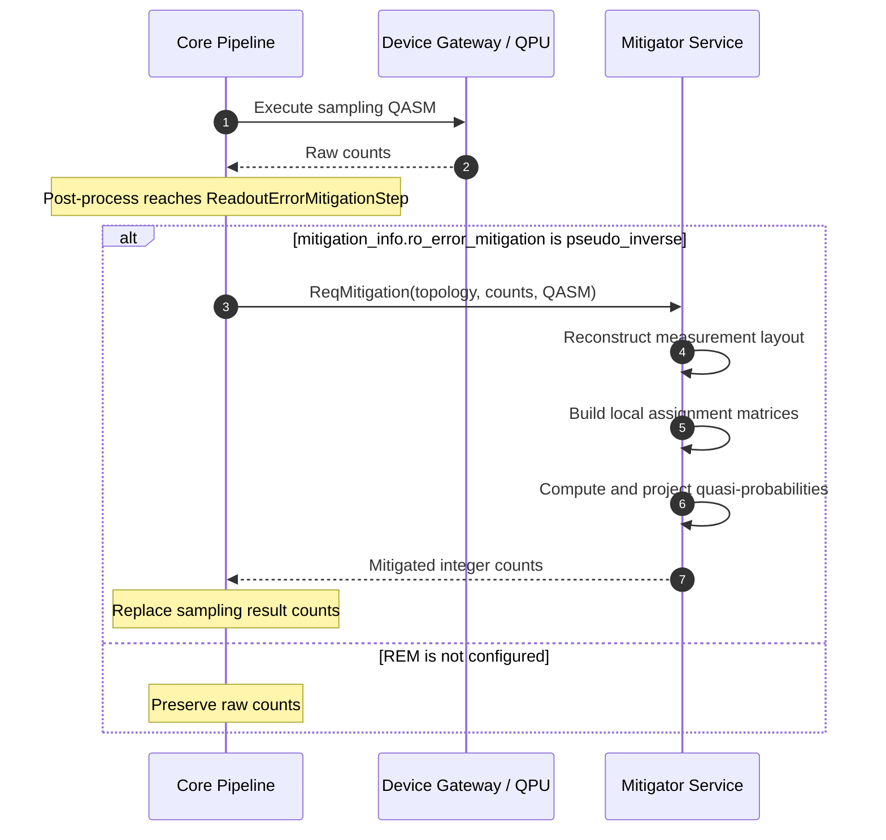

# Sampling Readout Mitigation

This document describes the local readout-mitigation path for sampling results.
The path converts raw measurement counts into mitigated integer counts and
stores them back in the sampling result. It covers pipeline responsibilities,
the correction algorithm, external-library usage, and the gRPC contract.

For the shared assignment-error model and measurement mapping, see
[Readout Error Mitigation](./overview.md).

## 1. Design Goals

A sampling job must return integer counts through its existing result contract.
The REM path therefore:

- corrects the complete measured probability distribution
- projects potentially negative quasi-probabilities onto a valid probability
    distribution
- converts the projected probabilities back to integer counts
- keeps Pauli operators and expectation-value semantics out of the sampling RPC

The probability-to-count conversion can discard fractional counts. Estimation
uses a separate direct expectation-value path to avoid that loss of precision.

## 2. Service Responsibilities

| Component | Responsibility |
| --- | --- |
| Device Gateway and QPU | Execute the sampling circuit and return raw counts. |
| Core `ReadoutErrorMitigationStep` | Select the counts path, build the request from device calibration data, and replace the sampling result counts. |
| Mitigator service | Reconstruct the measurement layout, configure local REM, and convert the corrected distribution to integer counts. |

## 3. Processing Sequence

## 4. Detailed Flow

### 4.1 Core Routing

After device execution, `ReadoutErrorMitigationStep` performs the following
operations:

1. It checks `mitigation_info.ro_error_mitigation`.
2. It reads `prob_meas1_prep0` and `prob_meas0_prep1` for each device qubit and
   maps them to `p0m1` and `p1m0` in the Mitigator request.
3. It sends the device topology, raw counts, and executed QASM program through
   `ReqMitigation`.
4. It replaces `job.result.sampling.counts` with the returned counts.

The counts path is selected when the `JobContext` does not contain estimation
Pauli metadata.

### 4.2 Distribution Correction

The Mitigator service:

1. Parses the QASM program and orders measured qubits by classical-bit index.
2. Creates a `LocalReadoutMitigator` from the selected qubits' assignment
   matrices.
3. Calls `quasi_probabilities()` with the observed counts and selected layout.
4. Projects the quasi-distribution to its nearest probability distribution.
5. Converts each probability to an integer count using the original shot count.

### 4.3 Result Replacement and Multi-Program Ordering

Core replaces `job.result.sampling.counts` with the returned counts. For a
normal sampling job, this is the final sampling result.

For a `multi_manual` job, the counts represent the combined sampling result.
Post-process traverses pipeline steps in reverse order, so REM corrects the
combined counts before `MultiManualStep` separates them into per-program
results.

## 5. External Library Use

| Operation | Owner |
| --- | --- |
| Parse the executed OpenQASM 3 program | Qiskit `qasm3.loads()`, backed by `qiskit-qasm3-import` |
| Represent observed counts | Qiskit `Counts` |
| Invert local assignment matrices and compute mitigated quasi-probabilities | Qiskit Experiments `LocalReadoutMitigator.quasi_probabilities()` |
| Project quasi-probabilities to the nearest probability distribution | Qiskit `QuasiDistribution.nearest_probability_distribution()` |
| Select measured bits, construct assignment matrices, and convert probabilities to integer counts | OQTOPUS Mitigator service |

The mitigation algorithm is therefore not implemented entirely by OQTOPUS.
OQTOPUS adapts device and circuit data to the external APIs and owns the final
sampling-result conversion. External dependency declarations are linked from the
[common REM overview](./overview.md#6-implementation-ownership-and-external-dependencies).

## 6. gRPC Contract

| Message | Fields used |
| --- | --- |
| `ReqMitigationRequest` | `device_topology`, `counts`, `program` |
| `ReqMitigationResponse` | `counts` |

Sampling REM does not accept Pauli labels and does not return expectation
values. Those semantics belong to the separate estimation REM contract.

## 7. Validation and Limits

- The OpenQASM 3 program must parse successfully and contain measurement
    operations.
- All measured destinations are included in the correction, up to the shared
    limit of 32 measured qubits.
- The output remains integer-valued. Truncating each corrected probability
    multiplied by the shot count can discard fractional counts.
- Sampling REM does not validate or process Pauli labels.
