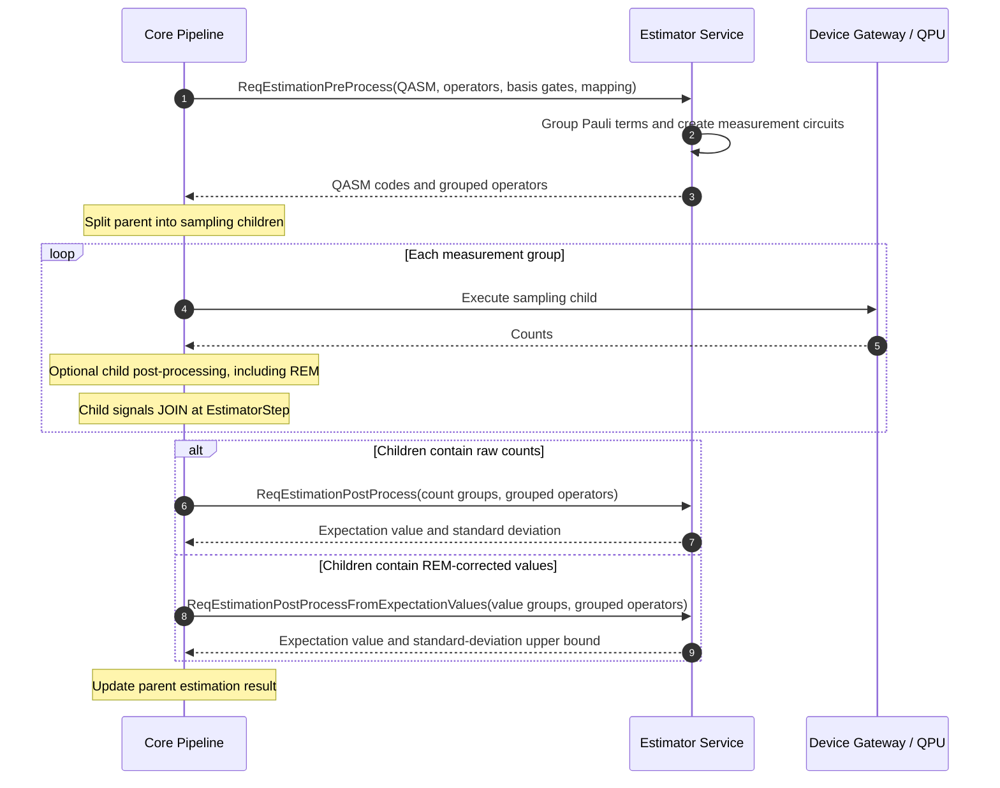

# Estimation

OQTOPUS Engine implements an estimation job as a coordinated set of sampling
executions. The Estimator service creates measurement circuits for grouped Pauli
terms, while Core owns child-job execution and aggregation.

For the pipeline framework's general split/join behavior, see
[Pipeline Execution](../../design/pipeline_execution.md). For the
mitigation-specific path, see
[Estimation Readout Mitigation](../error_mitigation/readout_mitigation/estimation.md).

## 1. Components

| Component | Responsibility |
| --- | --- |
| Core `EstimatorStep` | Calls the Estimator service, creates sampling children, preserves group order, and joins child results. |
| Estimator service | Groups observable terms, creates basis-measurement circuits, and aggregates group results. |
| Device Gateway and QPU | Execute the generated sampling circuits. |
| Mitigator service | Optionally corrects each child's Pauli expectation values before the join. |

## 2. Processing Sequence

## 3. Pre-process and Split

Core sends these values through `ReqEstimationPreProcess`:

- the original or transpiled OpenQASM 3 program
- the observable's Pauli terms and coefficients
- device basis gates
- the logical-to-physical qubit mapping, when available

The Estimator service applies the mapping to the observable, groups compatible
Pauli measurements, and returns one QASM program per group. The response also
contains grouped Pauli labels and coefficients needed for final aggregation.

Core stores the grouped operators and child order in the parent `JobContext`.
Each generated child:

- has `job_type` set to `sampling`
- carries one generated measurement QASM program
- records its group index and Pauli labels in its own `JobContext`
- runs independently through the configured pipeline

The parent pauses at `SPLIT_FOR_JOIN` until all children return to the
`EstimatorStep` join point during post-process.

## 4. Post-process and Join

The final child to reach the join point invokes parent aggregation exactly once.
Core restores the original child order and selects an aggregation RPC based on
the data present in every child context.

### 4.1 Counts Aggregation

Without expectation-value REM, Core sends each child's counts and the grouped
operators to `ReqEstimationPostProcess`. For each group, the Estimator service
calculates Pauli expectation values and sampling variances, multiplies them by
the observable coefficients, and accumulates the final result.

### 4.2 Corrected-Value Aggregation

With expectation-value REM, each child context contains corrected expectation
values and standard-deviation upper bounds. Core calls
`ReqEstimationPostProcessFromExpectationValues`; raw child counts are not part
of that request. The detailed flow and validation rules are documented in
[Estimation Readout Mitigation](../error_mitigation/readout_mitigation/estimation.md).

Core rejects a join that mixes raw and corrected child data. It also rejects a
corrected child that contains expectation values without corresponding
uncertainty bounds, or vice versa.

## 5. Result

After aggregation, Core updates the parent job's estimation result:

- `exp_value` contains the weighted expectation value.
- `stds` contains either the sampling standard deviation or the propagated
  standard-deviation upper bound, depending on the selected aggregation path.
- `execution_time` is the sum of child execution times.
- `message` is taken from the child that completed the join.

The source gRPC contract is maintained in the
[Estimator interface](../../../spec/estimator_interface/oqtopus_engine_core/interfaces/estimator_interface/v1/estimator.proto).

## 6. Transpilation Result Under Multi-Programming

The `transpile_result` reported for an estimation job describes the
transpilation of the submitted program, produced before the observable is
split into measurement circuits.

When multi-programming (auto-combining, see
[Configuration](../../usage/config.md)) is enabled, the engine may batch the
measurement circuits of one estimation job together with circuits from other
jobs and place each of them on a different region of the device. In that
case the qubit placement actually used at execution time differs from the
one reported in `virtual_physical_mapping`.

Sampling jobs are not affected: their `transpile_result` is updated to
reflect the placement chosen when combining. Estimation intentionally keeps
reporting the pre-combining (parent) `transpile_result` instead, since an
estimation job's measurement circuits can be split across more than one
combined job, each combined with a different set of peers; there is no
single post-combining placement to report against the parent's ID (Cloud's
per-job output-file keys are `{job_id}/{name}.zip` with `name` a fixed
enum). See
[Pipeline Execution: Job ID Conventions](../../design/pipeline_execution.md#12-job-id-conventions)
for how the engine tracks which Cloud record a child's outputs belong to.
