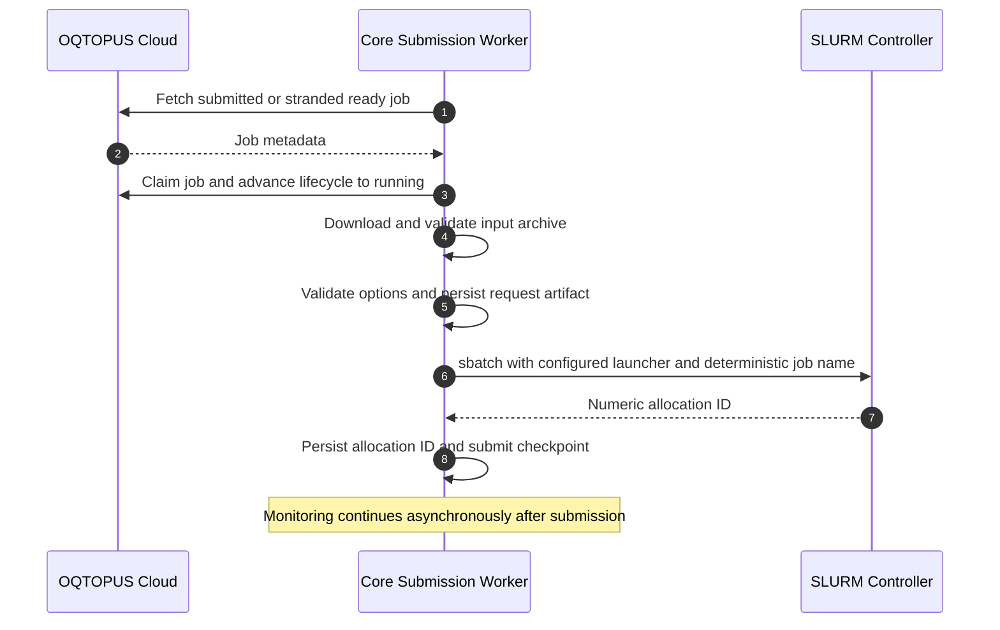
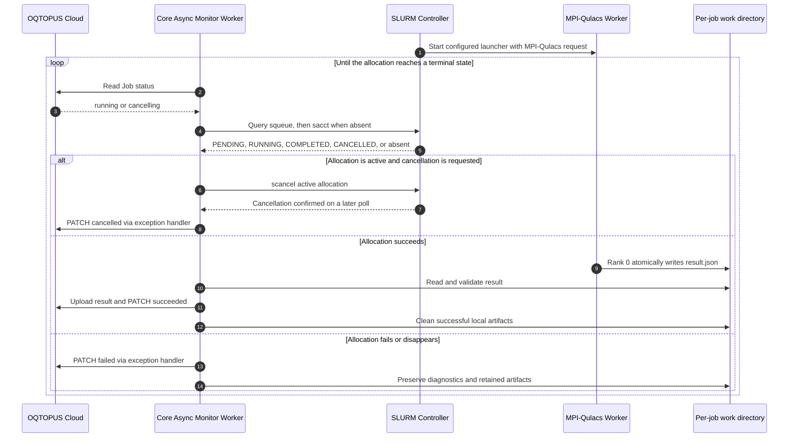
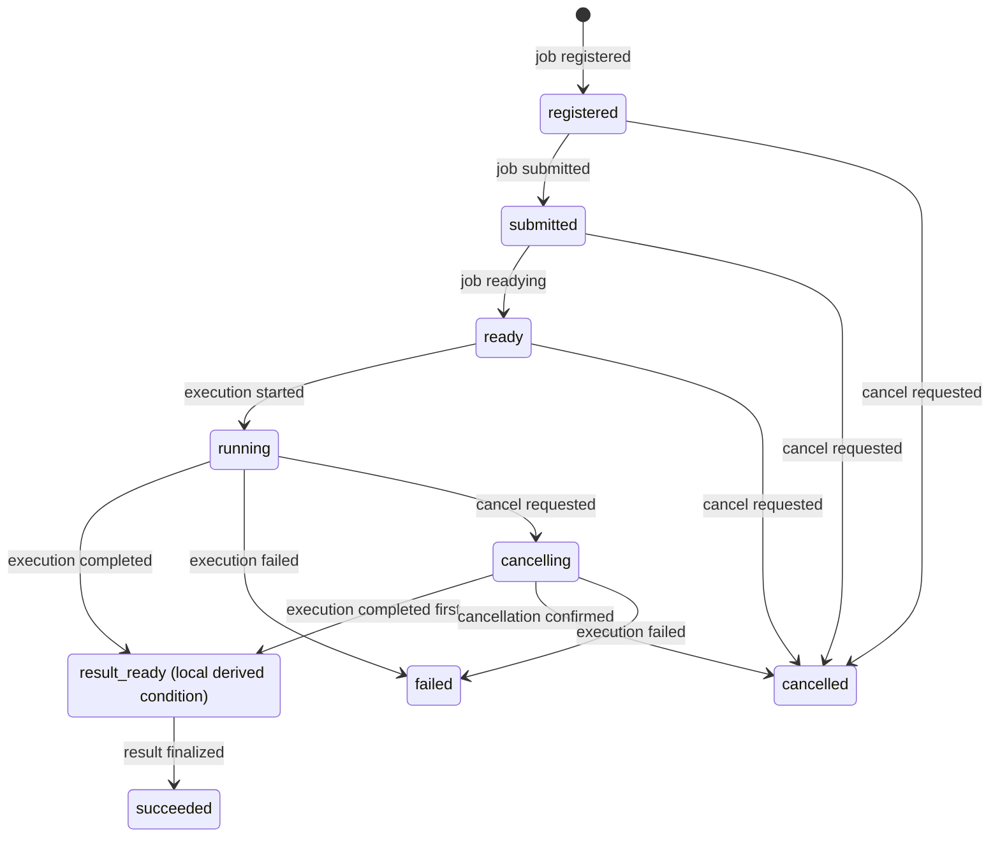
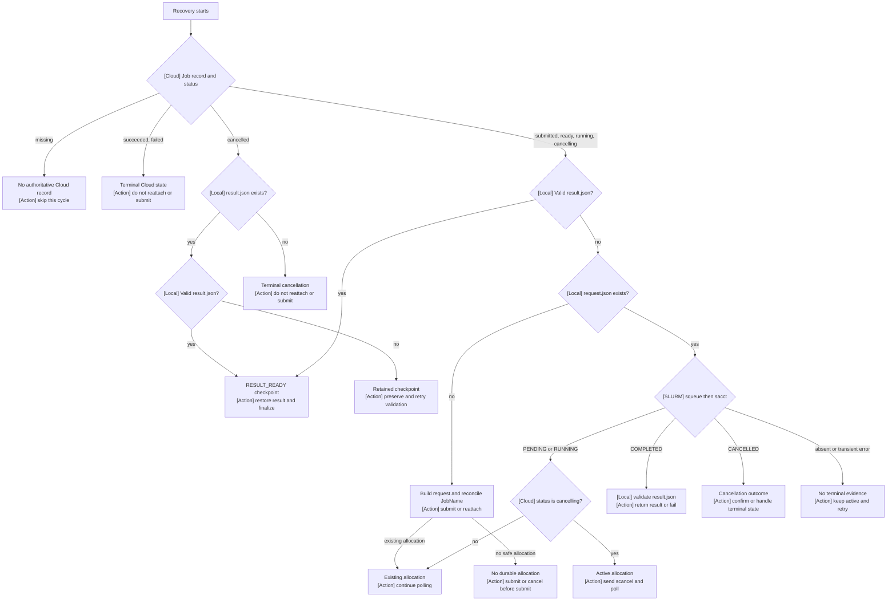

# SLURM MPI-Qulacs Simulator

The SLURM simulator is a dedicated Core execution path for large state-vector
simulations. It submits MPI-Qulacs allocations directly from a SLURM login node
without routing execution through Device Gateway. It supports sampling and
exact estimation while preserving the existing OQTOPUS Cloud job and result
contracts.

## 1. Design Goals

The direct SLURM path is designed to:

- execute distributed MPI-Qulacs simulations without introducing a
  Device Gateway protocol for scheduler operations
- keep partition, account, QoS, executable paths, and resource limits under
  administrator control
- convert input OpenQASM 3, or a program supplied by an optional transpilation
  step, into a versioned, data-only worker request
  instead of generating executable Python or shell source from job input
- prevent duplicate allocations across Core crashes and uncertain `sbatch`
  responses
- recover unfinished jobs and result finalization from durable Cloud state
- return sampling and estimation results through the existing Cloud contracts

## 2. Component Responsibilities

| Component | Responsibility |
| --- | --- |
| OQTOPUS Cloud | Owns job input, user-visible status, cancellation requests, and result storage through the existing Job fields. |
| Core `ConfiguredDeviceFetcher` | Publishes configured simulator metadata and marks the device available only while SLURM health checks succeed. |
| Core `SlurmJobFetcher` | Claims new jobs, rejects unsupported requests, and restores execution-owned jobs after restart. |
| Optional Tranqu Server | Transpiles circuits only when a custom pipeline includes `TranquStep`. |
| Core `SlurmSimulatorStep` | Validates options, builds the worker request, submits or reattaches an allocation, polls status, and restores the result. |
| Core `SlurmClient` | Executes `sinfo`, `sbatch`, `squeue`, `sacct`, and `scancel` without invoking a shell. |
| Cloud Provider Job API | Uses the existing job GET, list, and status PATCH operations without SLURM-specific columns or endpoints. |
| MPI-Qulacs worker | Executes the state-vector simulation and atomically writes a versioned result from rank 0. |
| Core `SimulatorLifecycleStep` | Initializes root jobs, uploads the validated result, then finalizes the existing Cloud job status through the existing status PATCH. |

The dedicated pipeline intentionally excludes Device Gateway, Estimator,
Mitigator, multi-programming steps, and SSE steps.

## 3. Processing Sequences

The processing is split at the point where `sbatch` returns. The submission
worker performs synchronous preparation and ends after the allocation ID and
submit checkpoint are durable. A separate asynchronous monitor worker then
owns long-running status polling, cancellation monitoring, and result
retrieval. The monitor can reattach from the persisted request and job name
after a Core restart.

### 3.1 Synchronous Submission



### 3.2 Asynchronous Monitoring, Cancellation, and Result Retrieval

After the submission checkpoint is persisted, the monitor worker operates
independently of the synchronous submission phase. SLURM starts the MPI-Qulacs
worker from the configured batch launcher while the monitor observes both Cloud and
SLURM state.



Cloud uses `running` for both SLURM `PENDING` and `RUNNING`; this path does not
add scheduler-specific states to the Cloud API.
The default SLURM pipeline does not include `TranquStep` and parses the input
OpenQASM directly. A custom pipeline can add `TranquStep` when transpilation is
required.

## 4. Detailed Flow

### 4.1 Device and Job Selection

The simulator device is defined by Core configuration rather than Device
Gateway discovery. `ConfiguredDeviceFetcher` supplies the device ID, qubit
count, basis gates, instructions, description, and complete device information
used by the SLURM pipeline and, when configured, Tranqu. The corresponding Cloud
device row must already exist. Core
updates its qubit count and availability but does not create the row or upload a
Device Gateway calibration archive.

The recovery-aware fetcher polls both `submitted` jobs and stranded `ready`
jobs. It claims each job with the existing atomic `ready` to `running` status
update before scheduling pipeline work. The existing job `device_id` identifies
the runtime that owns recovery. Jobs outside `sampling` and `estimation`, and
jobs with an enabled mitigation method, are rejected before execution.

### 4.2 Input Conversion and Worker Request

By default, neither supported job type passes through Tranqu. Core parses the
input OpenQASM 3 and converts only allowlisted static operations into a
versioned JSON request. It rejects unsupported operations before submitting an
allocation. If a custom pipeline adds `TranquStep`, Core uses its transpiled
program and qubit mapping when building the request.

For sampling, the request contains the shot count, optional seed, gate list,
and terminal measurement mapping. Every declared classical bit must be measured
exactly once so that result bit-string width is unambiguous.

For estimation, the request contains no measurements or shot count. Core maps
each observable using the persisted Tranqu qubit mapping when one is available;
otherwise it uses the identity mapping. It includes the resulting Pauli terms in
the worker request.

The canonical worker request and resolved scheduler resources form a SHA-256
request identity. Core persists the request under `SLURM_WORK_ROOT` and
recomputes the identity after restart before searching for its allocation.

### 4.3 Allocation and Execution

Core invokes `sbatch --parsable` with the resolved node count, total MPI task
count, tasks per node, time limit, and administrator-configured resources. The
total MPI task count is `n_nodes * n_per_node`, so SLURM reserves the MPI
topology when it creates the allocation. Job-controlled values are not inserted
into shell source or passed as scheduler configuration. The configured batch
script starts the worker with the request and result paths in the shared
per-job work directory. Core does not select an MPI launcher: the deployment
may use `srun`, `mpirun`, or a site-specific wrapper inside that script.

The execution adapter contract is:

- `SLURM_BATCH_SCRIPT` points to an executable visible at the same absolute
  path from the login node and every compute node. SLURM invokes it with the
  configured worker path as its only positional argument and with the per-job
  work directory as its current directory.
- `SLURM_WORKER_SCRIPT` points to the worker visible at the same absolute path.
  The batch script must start it with `request.json` and `result.json` as its
  two positional arguments, once for every MPI rank.
- The adapter must start the requested `n_per_node` ranks per node within the
  allocation already reserved by Core. It must not submit another SLURM job.
- The worker constructs the state-vector simulation and rank 0 writes the
  result artifact according to the worker protocol below.

The repository's `deployment/slurm/run_qulacs_mpi_job.sh` is a reference
adapter using `srun`. Deployments may replace it with an adapter for their MPI
implementation, CPU architecture, NUMA layout, or site wrapper without
changing Core. Such deployment-specific adapters are not part of the Engine
source tree.

The worker constructs a Qulacs `QuantumCircuit` and a multi-CPU
`QuantumState`. Sampling calls Qulacs state sampling and applies the persisted
classical-bit mapping. Direct estimation constructs a
`GeneralQuantumOperator` and evaluates its expectation value inside the MPI
allocation. Only rank 0 writes the result, using `fsync` and an atomic rename.

### 4.4 Worker Directory and Durable Artifacts

`SLURM_WORK_ROOT` is a shared, durable directory that is visible at the same
absolute path from the login node and every compute node. Each root Cloud job
gets a deterministic directory derived from its `job_id`:

```text
SLURM_WORK_ROOT/
└── <sha256(job_id)[:32]>/
  ├── request.json
  ├── result.json
  ├── stdout.log
  └── stderr.log
```

The files have different owners and recovery meanings:

| File | Writer | Durable meaning during recovery |
| --- | --- | --- |
| `request.json` | Core, before `sbatch` | The canonical versioned worker request and the persisted submit intent. Core writes it atomically and recomputes its hash after restart. A persisted request must be reconciled with the deterministic SLURM JobName; it must not trigger an unverified duplicate submission. |
| `result.json` | MPI-Qulacs rank 0, after completion | The worker result checkpoint. Rank 0 writes it with `fsync` and an atomic rename. Core validates it before deriving `RESULT_READY`, restoring the result, or finalizing the Cloud job. |
| `stdout.log` | SLURM | Standard output for diagnostics. It is not an authoritative execution-state checkpoint. |
| `stderr.log` | SLURM | Standard error for diagnostics. It is not an authoritative execution-state checkpoint. |

The presence of `request.json` and `result.json` is therefore part of the
recovery protocol, not merely temporary worker output. A valid `result.json`
allows Core to restore and finalize a result without another scheduler lookup;
an existing `request.json` without a valid result requires SLURM reconciliation
or continued polling. Missing or invalid artifacts do not justify blindly
submitting another allocation.

Root SLURM recovery does not introduce a local execution database or new Cloud
columns. The existing Cloud Job status supplies the user-visible lifecycle,
the local directory and its validated artifacts supply durable execution
checkpoints, and `squeue`/`sacct` supply the scheduler observation. The
Cloud-backed execution repository reconstructs this view after restart from
those sources. Internal estimation child jobs may use a small local
`<sha256(job_id)[:32]>.execution.json` bookkeeping file under the same root;
that file is local metadata rather than a database and is not the source of
truth for root-job recovery.

### 4.5 MPI-Qulacs Program Examples

Core converts the input circuit into Qulacs gate operations before the worker
starts. The following snippets show the corresponding MPI-Qulacs programs.
`use_multi_cpu=True` enables the distributed state vector, and rank 0 writes
the result artifact.

#### Sampling

The input circuit applies a CNOT to the initial `|00>` state and measures both
qubits. The Qulacs worker executes the equivalent circuit and samples 1000
shots.

API input:

```json
{
  "job_type": "sampling",
  "job_info": {
    "program": [
      "OPENQASM 3;\ninclude \"stdgates.inc\";\nqubit[2] q;\nbit[2] c;\ncx q[0], q[1];\nc = measure q;\n"
    ]
  },
  "shots": 1000,
  "simulator_info": {
    "backend": "mpi-qulacs",
    "n_nodes": 2,
    "n_per_node": 2,
    "seed_simulation": 7,
    "timeout_seconds": 300
  },
  "transpiler_info": {
    "transpiler_lib": null
  }
}
```

Core converts the uploaded OpenQASM directly in this case. `shots` and
`seed_simulation` become the arguments used by `state.sampling()`, while the
node and timeout settings are used by SLURM to reserve the MPI allocation.

```python
from collections import Counter

from mpi4py import MPI
from qulacs import QuantumCircuit, QuantumState

shots = 1000
circuit = QuantumCircuit(2)
circuit.add_CNOT_gate(0, 1)

state = QuantumState(2, use_multi_cpu=True)
circuit.update_quantum_state(state)

counts = Counter()
for sample in state.sampling(shots, 7):
  bitstring = "".join(str((sample >> qubit) & 1) for qubit in (1, 0))
  counts[bitstring] += 1

if MPI.COMM_WORLD.Get_rank() == 0:
  print({"counts": dict(counts)})
```

The output is deterministic for this circuit:

```json
{"counts": {"00": 1000}}
```

#### Estimation

The input circuit prepares the Bell state and evaluates
$1.5(X_0X_1)+1.2(Y_0Z_1)$. The Qulacs worker constructs the same operator and
evaluates its expectation value inside the MPI allocation.

API input:

```json
{
  "job_type": "estimation",
  "job_info": {
    "program": [
      "OPENQASM 3;\ninclude \"stdgates.inc\";\nqubit[2] q;\nh q[0];\ncx q[0], q[1];\n"
    ],
    "operator": [
      {"pauli": "X 0 X 1", "coeff": 1.5},
      {"pauli": "Y 0 Z 1", "coeff": 1.2}
    ]
  },
  "simulator_info": {
    "backend": "mpi-qulacs",
    "n_nodes": 2,
    "n_per_node": 2,
    "timeout_seconds": 300
  },
  "transpiler_info": {
    "transpiler_lib": null
  }
}
```

The default SLURM pipeline consumes the uploaded OpenQASM directly. Core maps
the gate operations to `QuantumCircuit` and the Pauli terms to
`GeneralQuantumOperator`; estimation does not use a `shots` field.

```python
from mpi4py import MPI
from qulacs import GeneralQuantumOperator, QuantumCircuit, QuantumState

circuit = QuantumCircuit(2)
circuit.add_H_gate(0)
circuit.add_CNOT_gate(0, 1)

state = QuantumState(2, use_multi_cpu=True)
circuit.update_quantum_state(state)

operator = GeneralQuantumOperator(2)
operator.add_operator(1.5, "X 0 X 1")
operator.add_operator(1.2, "Y 0 Z 1")
exp_value = operator.get_expectation_value(state)

if MPI.COMM_WORLD.Get_rank() == 0:
  print({"exp_value": [exp_value.real, exp_value.imag]})
```

The worker output is approximately `{"exp_value": [1.5, 0.0]}`. Core
publishes the real component as `exp_value: 1.5` with `stds: 0.0`.

### 4.6 Result Finalization

Core validates the worker result before updating the job:

- sampling count keys must have the expected bit width, values must be
  non-negative integers, and the total must equal the requested shots
- estimation output must contain finite real and imaginary components
- the estimation imaginary component must not exceed the configured tolerance
- the result job type must match the persisted request

After validation, the atomic result artifact represents `RESULT_READY`. Core
uploads the existing `JobResult` JSON representation and synchronously updates
the job to `succeeded`. A terminal Cloud `cancelled` job with a retained valid
result is recovered as `RESULT_READY` and is never resubmitted. Exact
estimation returns the real expectation value with `stds` set to `0.0`.

## 5. Recovery and Cancellation

The Cloud-visible states remain the same as the job state transition
diagram. `RESULT_READY` is a local derived condition represented by an active
Cloud job, or by a terminal `cancelled` job recovered with a validated atomic
result artifact:



A cancellation request is an event, not a terminal outcome. For a running job,
the User API changes the Cloud Job status to `cancelling`. Core treats this as
an effective running execution and resolves the race using the scheduler's
terminal observation. `COMPLETED` with a valid result advances to
`RESULT_READY`; confirmed `CANCELLED` advances to `CANCELLED`. Reaching
`RESULT_READY` means completion won the race, so a later cancellation request
cannot replace the result.

Engine restart does not cause a state transition and is intentionally omitted
from the diagram. Recovery resumes observation in `RUNNING` or `cancelling`,
or restores a retained result from a terminal `cancelled` job. A recovered
cancelled result is never submitted again.

For a running job, the User API atomically changes the Cloud status from
`running` to `cancelling`. Engine then confirms `succeeded`, `failed`, or
`cancelled`. Pre-execution cancellation from `registered`, `submitted`, or
`ready` still advances directly to `cancelled`.

Direct SLURM adds no database column. It uses the `cancelling` Job status and
derives the following effective execution states:

| Execution state | Purpose |
| --- | --- |
| `READY` | The Cloud job is `submitted` or `ready`. |
| `RUNNING` | The Cloud job is `running` or `cancelling` and has no result artifact. |
| `RESULT_READY` | The Cloud job is `running` or `cancelling`, or is `cancelled` with a retained atomic result artifact that exists and validates. |
| `SUCCEEDED` | The Cloud job is `succeeded`. |
| `FAILED` | The Cloud job is `failed`. |
| `CANCELLED` | The Cloud job is `cancelled`. |

Request identity is recomputed from the persisted request artifact and existing
`simulator_info`. SLURM `PENDING` and `RUNNING` remain scheduler observations;
both correspond to effective `RUNNING` while the Cloud Job is `running` or
`cancelling`.

On startup, Core requests every recoverable execution for its configured
`device_id` before polling new jobs. It uses `squeue` for
live allocations and `sacct` after an allocation leaves the queue. Transient
Cloud and SLURM observation failures are retried without converting an active
allocation to `failed`. An allocation temporarily absent from both `squeue` and
`sacct` also remains `RUNNING` and is polled until SLURM reports an explicit
state.

### 5.1 Recovery Decision Flow

Recovery reads three evidence sources in a fixed order. The source labels in
the flow and table below are intentional:

- **Cloud**: the current Job record and its user-visible status
- **Local**: `request.json` and the atomic `result.json` under the derived work
  directory
- **SLURM**: the live or accounting observation from `squeue` and `sacct`

`result_ready` is a derived condition rather than a Cloud status. Core derives
absolute work, request, and result paths from `SLURM_WORK_ROOT` and the Cloud
job ID on every process start. A scheduler observation is never interpreted in
isolation: the Cloud status determines cancellation intent, local artifacts
determine which checkpoint is durable, and SLURM determines whether an
allocation is still active or has reached a terminal state.

The decision order is shown below. The diagram is intentionally coarse-grained;
the matrix underneath carries exact-match, duplicate-match, and cancellation
edge cases.



The corresponding decision matrix keeps each raw input in its own column. The
**Interpretation** column is the low-level-to-execution-state mapping, and the
**Actual processing** column is the operation performed by Core.

| Cloud status | Local `request.json` | Local `result.json` | SLURM observation | Interpretation | Actual processing |
| --- | --- | --- | --- | --- | --- |
| `submitted` or `ready` | absent | absent | not queried | No submit intent is durable and no allocation is required. | **Resubmit**: build and persist the request, then call `sbatch`. |
| `running` | absent | absent | one exact JobName match | Cloud claimed the job, and an allocation may have been accepted before the request checkpoint was written. | **Continue existing job**: rebuild the request, attach the exact match, persist the checkpoint, and poll. |
| `running` | absent | absent | no exact match | There is no durable submit intent and no allocation to reattach. | **Resubmit**: build and persist the request, then call `sbatch`. |
| `running` | absent | absent | multiple matches | The allocation identity cannot be determined safely. | **Manual reconciliation**: do not resubmit. |
| `running` | present | absent | `PENDING` or `RUNNING` | A durable request exists and the allocation is active. | **Continue existing job**: poll Cloud and SLURM. |
| `running` | present | absent | `COMPLETED` and valid result | The scheduler completed and the local result checkpoint is usable. | **Return result**: restore the result, mark `RESULT_READY`, and finalize Cloud. |
| `running` | present | absent or invalid | `COMPLETED` | The scheduler completed, but no valid result can be returned. | **Terminal failure handling**: retain diagnostics and do not resubmit. |
| `running` | present | absent | `CANCELLED` | The allocation was cancelled independently of the Cloud cancellation intent. | **Terminal cancellation handling**: do not resubmit. |
| `cancelling` | absent | absent | no allocation expected | Cancellation arrived before a submit intent was durable. | **Cancel without submission**: advance to `cancelled`. |
| `cancelling` | present | absent | `PENDING` or `RUNNING` | Cancellation is requested while the allocation is active. | **Resend cancellation**: issue `scancel`, keep `cancelling`, and poll for confirmation. A transient delivery failure keeps the job recoverable for the next retry. |
| `cancelling` | present | absent | `COMPLETED` and valid result | Completion won the cancellation race. | **Return result**: validate the result, preserve `RESULT_READY`, and finalize success. |
| `cancelling` | present | absent | `CANCELLED` | SLURM confirmed the requested cancellation. | **Confirm cancellation**: advance to `cancelled`. |
| `running` or `cancelling` | present or absent | valid result | not queried | The local result checkpoint is authoritative for finalization. | **Return result**: skip scheduler actions and retry restoration and finalization. |
| `cancelled` | any | valid result | not queried | Completion left a usable checkpoint after Cloud cancellation. | **Return result**: restore the result, finalize success, and never resubmit. |
| `cancelled` | any | present but invalid | not queried | A retained checkpoint exists, but validation must succeed before finalization. | **Preserve checkpoint**: retain `RESULT_READY`, report the validation error, and retry repair or finalization. |
| `cancelled` | any | absent | not queried | Cloud cancellation is terminal and no result checkpoint exists. | **Confirm cancellation**: keep `cancelled` and clean retained artifacts after the normal retention period. |
| any active status | any | any | allocation absent from both `squeue` and `sacct`, or observation failed transiently | No authoritative terminal state exists yet. | **Retry observation**: keep the active state and never resubmit a persisted submit intent. |
| any active status | any | any | Cloud Job is missing | There is no authoritative Cloud record for a safe update. | **Skip recovery**: log the condition and wait for retry or operator reconciliation. |

The Cloud Job, local execution record, and SLURM allocation are linked through
deterministic identifiers rather than a SLURM-specific Cloud column:

| Layer | Identifier or artifact | Relation to the next layer |
| --- | --- | --- |
| Cloud Job | `job_id` | The source identifier for all derived paths and scheduler labels. |
| Local work directory | `SLURM_WORK_ROOT / sha256(job_id)[:32]` | Contains `request.json`, `result.json`, stdout, and stderr for that Cloud Job. |
| Request identity | Hash of the canonical request and resolved scheduler options | Recomputed after restart and used to derive the scheduler JobName. |
| SLURM JobName | `oqtopus-{sha256(job_id)[:16]}-{request_hash[:16]}` | The exact lookup key for reattachment in `squeue` and `sacct`. |
| SLURM comment | `oqtopus:{sha256(job_id)[:16]}:{request_hash[:16]}` | Diagnostic metadata only; recovery does not depend on accounting comments. |
| Numeric allocation ID | The `sbatch --parsable` result | Used by `get_status()` and `scancel()` after an allocation is attached. |

The association can be summarized as:

```text
Cloud job_id
  -> deterministic work directory
  -> canonical request + resolved options
  -> request hash
  -> exact SLURM JobName
  -> numeric allocation ID
```

`find_job()` searches both `squeue --name` and `sacct --name` and accepts only
one exact allocation match. `get_status()` uses the numeric allocation ID to
query `squeue` first and `sacct` after queue eviction. The Cloud-backed
execution repository does not add a scheduler-specific column; after restart,
the allocation ID is recovered from the deterministic JobName when it is not
already available in the execution record.

If `sbatch` may have accepted the job without returning a usable response, Core
does not repeat the command. A later recovery searches accounting from before
the existing job submission or ready timestamp and may reattach only one exact
job-name match. No match after restart or multiple matches becomes `FAILED` and
requires manual reconciliation. The specific reconciliation failure remains
available through the existing job `message` field.

Under the race-aware cancellation contract, Cloud persists cancellation intent
as `cancelling`, then Core checks the allocation state. It sends `scancel`
only while the allocation is active and waits for scheduler confirmation. A
`COMPLETED` observation restores and validates the result before moving to
`RESULT_READY`; a `CANCELLED` observation updates the existing Job status to
`cancelled`.
Transient observation or cancellation failures remain recoverable from
`cancelling`.

Finalization is retried in process. If retries are exhausted, the validated
result remains `RESULT_READY` and startup recovery attempts finalization again.
Terminal status and result fields are committed by one existing
`PATCH /jobs/{job_id}/status` request. Successful work directories are removed
immediately. Failed and cancelled artifacts are retained until their configured
TTL expires, then cleanup removes the derived local work directory. Terminal
Job statuses prevent a second claim.

## 6. Job Options

The `simulator_info` object uses strict snake_case fields:

| Field | Meaning |
| --- | --- |
| `backend` | Must be `mpi-qulacs`. |
| `n_nodes` | Requested node count; when omitted, Core derives the minimum from the input or transpiled qubit count. |
| `n_per_node` | MPI process count reserved and started per node. |
| `seed_simulation` | Optional deterministic simulation seed. |
| `timeout_seconds` | SLURM allocation time limit in seconds. |

For example:

```json
{
  "backend": "mpi-qulacs",
  "n_nodes": 4,
  "n_per_node": 2,
  "seed_simulation": 1234,
  "timeout_seconds": 3600
}
```

Unknown fields, booleans used as integers, invalid types, and administrator
limit violations fail validation before submission.

## 7. Deployment Requirements

For environment-specific setup, runtime construction, adapter selection, and
customization guidance, see [SLURM MPI-Qulacs Deployment Guide](deployment.md).

- Core runs as one process on a SLURM login node.
- `sinfo`, `sbatch`, `squeue`, `sacct`, and `scancel` are available to Core.
- OQTOPUS Cloud is reachable from the login node. A Tranqu Server is required
  only when a custom pipeline enables `TranquStep`.
- The configured batch adapter, worker script, and per-job work root are
  visible at the same absolute paths on login and compute nodes.
- The configured batch adapter starts the worker inside the existing
  allocation. Core does not require a particular MPI launcher; the adapter is
  responsible for the site's `srun`, `mpirun`, MPI environment, and NUMA
  settings.
- Compute nodes provide Python 3, `mpi4py`, and an MPI-enabled Qulacs build.
- No SLURM-specific Cloud database migration is required.
- The existing Cloud Provider `GET /jobs`, `GET /jobs/{job_id}`, and
  `PATCH /jobs/{job_id}/status` endpoints are reachable from the login node.
- The work root survives Core and login-node restarts, and the process-lock path
  is shared by competing Core processes on the login node.
- Only one Core process owns a simulator `device_id`.

### 7.1 Local validation

The repository includes an Engine-owned Docker fixture for validating the
real scheduler and MPI-Qulacs worker. Run it from the Engine repository root:

```bash
make -C test-infra/scheduler/slurm smoke
```

The fixture covers a two-node, four-rank MPI probe, sampling, direct
estimation, accounting comment visibility, controller restart recovery, and
cancellation. The named Docker volumes remain after `down`; use
`make -C test-infra/scheduler/slurm down-volumes` when a fresh accounting
database is needed. The fixture setup and host-Core bridge are documented in
[`test-infra/scheduler/slurm/README.md`](../../../test-infra/scheduler/slurm/README.md).

The process-level recovery and cancellation tests use a fake scheduler and a
schema-compatible worker. Run them with:

```bash
cd core && make test-slurm-process
```

These tests validate Core lifecycle and scheduler recovery behavior but do not
replace the real MPI-Qulacs Docker smoke test.

The dedicated runtime uses
[`core/config/slurm_simulator_config.yaml`](../../../core/config/slurm_simulator_config.yaml).
Set these required environment variables:

| Variable | Description |
| --- | --- |
| `SLURM_PARTITION` | Partition used for health checks and submissions |
| `SLURM_DEVICE_N_QUBITS` | Maximum logical qubit count advertised to Cloud |
| `SLURM_DEVICE_INFO` | Complete OQTOPUS device JSON used by the simulator and optional Tranqu step |
| `SLURM_WORK_ROOT` | Shared, durable per-job work directory |
| `SLURM_BATCH_SCRIPT` | Shared executable path to the deployment's SLURM execution adapter |
| `SLURM_WORKER_SCRIPT` | Shared worker path passed to the batch adapter |

The Engine repository includes a portable `srun` adapter as a reference and
uses a Docker-specific adapter for its scheduler fixture. A production site
may set `SLURM_BATCH_SCRIPT` to an external adapter that selects `mpirun`, an
architecture-specific Python environment, MPI library settings, or NUMA
binding. Keep that adapter outside the Engine repository when it contains
site-local configuration.

`SLURM_QUBITS_PER_NODE` optionally configures the state-vector qubit capacity
of one node and defaults to `30`. When `n_nodes` is omitted, Core derives the
minimum as
`2 ** max(n_qubits - SLURM_QUBITS_PER_NODE, 0)`. Set the capacity from the
memory available to each node and the worker's state-vector representation.

`SLURM_ACCOUNT` and `SLURM_QOS` are optional. The process lock defaults below
`~/.local/state/oqtopus-engine/slurm/`; override `SLURM_PROCESS_LOCK_PATH` when
local home storage is not durable across login-node restarts.

`SLURM_ARTIFACT_TTL_SECONDS` controls terminal artifact retention.
`SLURM_FINALIZE_RETRY_COUNT` and `SLURM_FINALIZE_RETRY_INTERVAL_SECONDS`
control result upload and Cloud status retries.

From the `core` directory, start the runtime with:

```bash
make run-slurm-simulator
```

## 8. Observability

Structured logs identify the Cloud job, SLURM allocation, normalized state,
recovery reason, and cancellation reason without logging program or operator
content.

At DEBUG level, the submission path also records the sanitized `sbatch` command,
the configured batch and worker script contents, and the resulting allocation
ID. Script output is size-limited and secret-like assignment values are replaced
with `<redacted>`. The input QASM and Qulacs `request.json` contents are not
written to the Engine log; they remain in the per-job work directory.

When monitoring is enabled, Core emits OpenTelemetry metrics under the
`oqtopus.slurm.*` namespace for:

- submitted allocations
- SLURM command errors
- cancellation commands
- recovered executions
- active running allocations
- terminal execution duration

## 9. Validation and Limits

- Only `sampling` and `estimation` jobs are supported.
- Mitigation, multi-manual, and SSE jobs are unsupported.
- Circuits must contain allowlisted unitary gates only.
- Sampling supports terminal measurements only and requires every declared
  classical bit to be measured exactly once.
- Estimation circuits must not contain measurements.
- Dynamic control flow, mid-circuit measurements, and reset are unsupported.
- Node count, processes per node, timeout, and sampling shots are bounded by
  administrator-configured limits.
- Estimation operators must contain valid Pauli factors with an unambiguous
  logical-to-physical qubit mapping.
- Direct estimation is exact and reports `stds=0.0`; it does not estimate
  sampling uncertainty.
- High availability and multiple Core processes sharing one simulator device
  are outside the current execution model.
