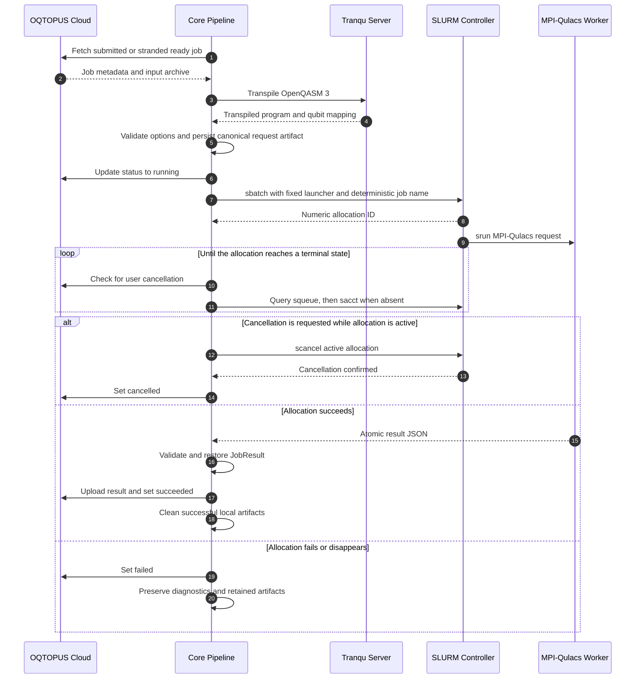
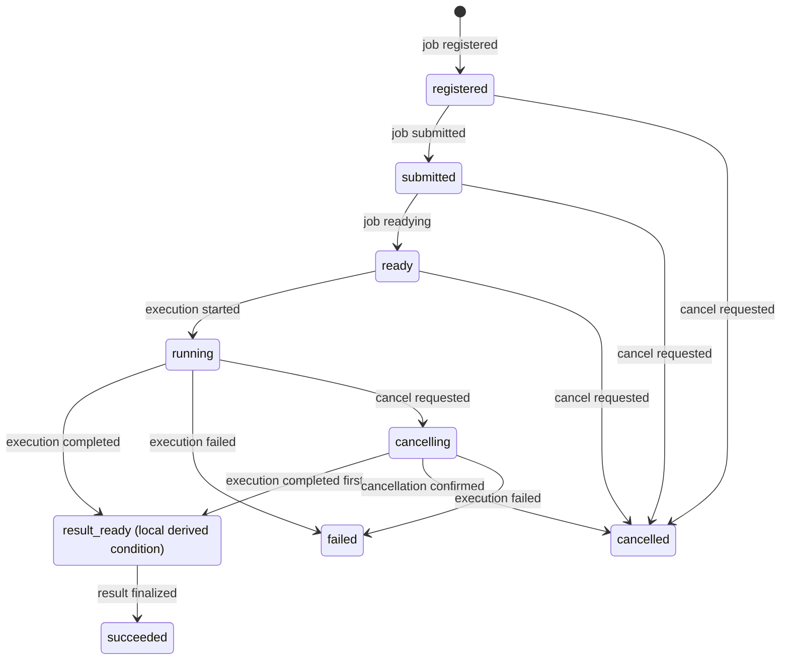

# SLURM MPI-Qulacs Simulator

The SLURM simulator is a dedicated Core execution path for large state-vector
simulations. It submits MPI-Qulacs allocations directly from a SLURM login node
without routing execution through Device Gateway. It supports sampling and
exact estimation while preserving the existing OQTOPUS Cloud job and result
contracts.

## 1. Design Goals

The direct SLURM path is designed to:

- execute distributed MPI-Qulacs simulations without introducing a
  Device Gateway protocol for scheduler operations
- keep partition, account, QoS, executable paths, and resource limits under
  administrator control
- convert transpiled OpenQASM 3 into a versioned, data-only worker request
  instead of generating executable Python or shell source from job input
- prevent duplicate allocations across Core crashes and uncertain `sbatch`
  responses
- recover unfinished jobs and result finalization from durable Cloud state
- return sampling and estimation results through the existing Cloud contracts

## 2. Component Responsibilities

| Component | Responsibility |
| --- | --- |
| OQTOPUS Cloud | Owns job input, user-visible status, cancellation requests, and result storage through the existing Job fields. |
| Core `ConfiguredDeviceFetcher` | Publishes configured simulator metadata and marks the device available only while SLURM health checks succeed. |
| Core `SlurmJobFetcher` | Claims new jobs, rejects unsupported requests, and restores execution-owned jobs after restart. |
| Tranqu Server | Transpiles sampling and estimation circuits for the configured simulator topology. |
| Core `SlurmSimulatorStep` | Validates options, builds the worker request, submits or reattaches an allocation, polls status, and restores the result. |
| Core `SlurmClient` | Executes `sinfo`, `sbatch`, `squeue`, `sacct`, and `scancel` without invoking a shell. |
| Cloud Provider Job API | Uses the existing job GET, list, and status PATCH operations without SLURM-specific columns or endpoints. |
| MPI-Qulacs worker | Executes the state-vector simulation and atomically writes a versioned result from rank 0. |
| Core `SessionStep` | Initializes root jobs, uploads the validated result, then finalizes the existing Cloud job status through the existing status PATCH. |

The dedicated pipeline intentionally excludes Device Gateway, Estimator,
Mitigator, multi-programming steps, and SSE steps.

## 3. Processing Sequence



Cloud uses `running` for both SLURM `PENDING` and `RUNNING`; this path does not
add scheduler-specific states to the Cloud API.

## 4. Detailed Flow

### 4.1 Device and Job Selection

The simulator device is defined by Core configuration rather than Device
Gateway discovery. `ConfiguredDeviceFetcher` supplies the device ID, qubit
count, basis gates, instructions, description, and complete device information
used by Tranqu. The corresponding Cloud device row must already exist. Core
updates its qubit count and availability but does not create the row or upload a
Device Gateway calibration archive.

The recovery-aware fetcher polls both `submitted` jobs and stranded `ready`
jobs. It claims each job with the existing atomic `ready` to `running` status
update before scheduling pipeline work. The existing job `device_id` identifies
the runtime that owns recovery. Jobs outside `sampling` and `estimation`, and
jobs with an enabled mitigation method, are rejected before execution.

### 4.2 Transpilation and Worker Request

Both supported job types pass through Tranqu. Core parses the transpiled
OpenQASM 3 and converts only allowlisted static operations into a versioned JSON
request. It rejects unsupported operations before submitting an allocation.

For sampling, the request contains the shot count, optional seed, gate list,
and terminal measurement mapping. Every declared classical bit must be measured
exactly once so that result bit-string width is unambiguous.

For estimation, the request contains no measurements or shot count. Core maps
each observable from logical to physical qubit indices using Tranqu's qubit
mapping and includes the resulting Pauli terms in the worker request.

The canonical worker request and resolved scheduler resources form a SHA-256
request identity. Core persists the request under `SLURM_WORK_ROOT` and
recomputes the identity after restart before searching for its allocation.

### 4.3 Allocation and Execution

Core invokes `sbatch --parsable` with the resolved node count, total MPI task
count, tasks per node, time limit, and administrator-configured resources. The
total MPI task count is `n_nodes * n_per_node`, so SLURM reserves the MPI
topology when it creates the allocation. Job-controlled values are not inserted
into shell source or passed as scheduler configuration. The launcher starts the
fixed Python worker with `srun --ntasks-per-node=n_per_node`; the request and
result paths are located in a shared per-job work directory.

The worker constructs a Qulacs `QuantumCircuit` and a multi-CPU
`QuantumState`. Sampling calls Qulacs state sampling and applies the persisted
classical-bit mapping. Direct estimation constructs a
`GeneralQuantumOperator` and evaluates its expectation value inside the MPI
allocation. Only rank 0 writes the result, using `fsync` and an atomic rename.

### 4.4 Result Finalization

Core validates the worker result before updating the job:

- sampling count keys must have the expected bit width, values must be
  non-negative integers, and the total must equal the requested shots
- estimation output must contain finite real and imaginary components
- the estimation imaginary component must not exceed the configured tolerance
- the result job type must match the persisted request

After validation, the atomic result artifact represents `RESULT_READY`. Core
uploads the existing `JobResult` JSON representation and synchronously updates
the job to `succeeded`. Exact estimation returns the real expectation value
with `stds` set to `0.0`.

## 5. Recovery and Cancellation

The Cloud-visible states remain the same as the `develop` job state transition
diagram. `RESULT_READY` is a local derived condition represented by a
`running` Cloud job with a validated atomic result artifact:



A cancellation request is an event, not a terminal outcome. For a running job,
the User API changes the Cloud Job status to `cancelling`. Core treats this as
an effective running execution and resolves the race using the scheduler's
terminal observation. `COMPLETED` with a valid result advances to
`RESULT_READY`; confirmed `CANCELLED` advances to `CANCELLED`. Reaching
`RESULT_READY` means completion won the race, so a later cancellation request
cannot replace the result.

Engine restart does not cause a state transition and is intentionally omitted
from the diagram. Recovery resumes observation in `RUNNING` or `cancelling`,
or retries Cloud finalization in `RESULT_READY`.

For a running job, the User API atomically changes the Cloud status from
`running` to `cancelling`. Engine then confirms `succeeded`, `failed`, or
`cancelled`. Pre-execution cancellation from `registered`, `submitted`, or
`ready` still advances directly to `cancelled`.

Direct SLURM adds no database column. It uses the `cancelling` Job status and
derives the following effective execution states:

| Execution state | Purpose |
| --- | --- |
| `READY` | The Cloud job is `submitted` or `ready`. |
| `RUNNING` | The Cloud job is `running` or `cancelling` and has no result artifact. |
| `RESULT_READY` | The Cloud job is `running` or `cancelling` and its atomic result artifact exists and validates. |
| `SUCCEEDED` | The Cloud job is `succeeded`. |
| `FAILED` | The Cloud job is `failed`. |
| `CANCELLED` | The Cloud job is `cancelled`. |

Request identity is recomputed from the persisted request artifact and existing
`simulator_info`. SLURM `PENDING` and `RUNNING` remain scheduler observations;
both correspond to effective `RUNNING` while the Cloud Job is `running` or
`cancelling`.

On startup, Core requests every recoverable execution for its configured
`device_id` before polling new jobs. It uses `squeue` for
live allocations and `sacct` after an allocation leaves the queue. Transient
Cloud and SLURM observation failures are retried without converting an active
allocation to `failed`. An allocation temporarily absent from both `squeue` and
`sacct` also remains `RUNNING` and is polled until SLURM reports an explicit
state.

### 5.1 Recovery by State

The recovery action depends on the existing Cloud job status and local durable
artifacts. `result_ready` below is a derived condition rather than a Cloud
status. Core derives absolute work, request, and result paths
from `SLURM_WORK_ROOT` and the Cloud job ID on every process start.

| State or condition | Evidence checked after restart | Recovery action | Next state or condition |
| --- | --- | --- | --- |
| `ready` | Derived request path | Atomically update the existing Job status to `running`, then prepare the request. | `running` |
| `running` | Persisted request plus deterministic job name in `squeue`, then `sacct` | Reattach the single exact allocation match. Never repeat an uncertain submission. | `running`, `result_ready`, `failed`, or `cancelled` |
| `cancelling` | Cloud Job status and allocation state | Resume reconciliation. Cancel an active allocation; accept a valid result if `COMPLETED` won the race. | `cancelling`, `result_ready`, `cancelled`, or `failed` |
| `result_ready` | Persisted request and validated result | Skip SLURM execution and retry result upload plus the Cloud `succeeded` update. | `result_ready` until confirmation, then `succeeded` |
| Unsynchronized `failed` or `cancelled` | Cloud job status | Retry only the matching terminal Cloud status update. | Same terminal state with Cloud synchronization confirmed |
| Confirmed terminal state | Local work directory and Job `ended_at` | Do not enqueue the job again; clean local artifacts when their TTL expires. | No transition |

Before submission, Core assigns a deterministic job name derived from hashes of
the Cloud job ID and request identity. It also submits the same identity as a
diagnostic comment, but recovery does not depend on accounting storing comments.
If `sbatch` may have accepted the job without returning a usable response, Core
does not repeat the command. A later recovery searches accounting from before
the existing job submission or ready timestamp and may reattach only one exact
job-name match. No match after restart or multiple matches becomes `FAILED` and
requires manual reconciliation. The specific reconciliation failure remains
available through the existing job `message` field.

Under the race-aware cancellation contract, Cloud persists cancellation intent
as `cancelling`, then Core checks the allocation state. It sends `scancel`
only while the allocation is active and waits for scheduler confirmation. A
`COMPLETED` observation restores and validates the result before moving to
`RESULT_READY`; a `CANCELLED` observation updates the existing Job status to
`cancelled`.
Transient observation or cancellation failures remain recoverable from
`cancelling`.

Finalization is retried in process. If retries are exhausted, the validated
result remains `RESULT_READY` and startup recovery attempts finalization again.
Terminal status and result fields are committed by one existing
`PATCH /jobs/{job_id}/status` request. Successful work directories are removed
immediately. Failed and cancelled artifacts are retained until their configured
TTL expires, then cleanup removes the derived local work directory. Terminal
Job statuses prevent a second claim.

## 6. Job Options

The `simulator_info` object uses strict snake_case fields:

| Field | Meaning |
| --- | --- |
| `backend` | Must be `mpi-qulacs`. |
| `n_nodes` | Requested node count; when omitted, Core derives the minimum from the transpiled qubit count. |
| `n_per_node` | MPI process count reserved and started per node. |
| `seed_simulation` | Optional deterministic simulation seed. |
| `timeout_seconds` | SLURM allocation time limit in seconds. |

For example:

```json
{
  "backend": "mpi-qulacs",
  "n_nodes": 4,
  "n_per_node": 2,
  "seed_simulation": 1234,
  "timeout_seconds": 3600
}
```

Unknown fields, booleans used as integers, invalid types, and administrator
limit violations fail validation before submission.

## 7. Deployment Requirements

- Core runs as one process on a SLURM login node.
- `sinfo`, `sbatch`, `squeue`, `sacct`, and `scancel` are available to Core.
- Tranqu Server and OQTOPUS Cloud are reachable from the login node.
- The batch script, worker script, and per-job work root are visible at the
  same absolute paths on login and compute nodes.
- Compute nodes provide Python 3, `mpi4py`, and an MPI-enabled Qulacs build.
- No SLURM-specific Cloud database migration is required.
- The existing Cloud Provider `GET /jobs`, `GET /jobs/{job_id}`, and
  `PATCH /jobs/{job_id}/status` endpoints are reachable from the login node.
- The work root survives Core and login-node restarts, and the process-lock path
  is shared by competing Core processes on the login node.
- Only one Core process owns a simulator `device_id`.

The dedicated runtime uses
[`core/config/slurm_simulator_config.yaml`](../../../core/config/slurm_simulator_config.yaml).
Set these required environment variables:

| Variable | Description |
| --- | --- |
| `SLURM_PARTITION` | Partition used for health checks and submissions |
| `SLURM_DEVICE_N_QUBITS` | Maximum logical qubit count advertised to Cloud |
| `SLURM_DEVICE_INFO` | Complete OQTOPUS device JSON consumed by Tranqu |
| `SLURM_WORK_ROOT` | Shared, durable per-job work directory |
| `SLURM_BATCH_SCRIPT` | Shared path to `run_qulacs_mpi_job.sh` |
| `SLURM_WORKER_SCRIPT` | Shared path to `run_qulacs_mpi.py` |

`SLURM_QUBITS_PER_NODE` optionally configures the state-vector qubit capacity
of one node and defaults to `30`. When `n_nodes` is omitted, Core derives the
minimum as
`2 ** max(n_qubits - SLURM_QUBITS_PER_NODE, 0)`. Set the capacity from the
memory available to each node and the worker's state-vector representation.

`SLURM_ACCOUNT` and `SLURM_QOS` are optional. The process lock defaults below
`~/.local/state/oqtopus-engine/slurm/`; override `SLURM_PROCESS_LOCK_PATH` when
local home storage is not durable across login-node restarts.

`SLURM_ARTIFACT_TTL_SECONDS` controls terminal artifact retention.
`SLURM_FINALIZE_RETRY_COUNT` and `SLURM_FINALIZE_RETRY_INTERVAL_SECONDS`
control result upload and Cloud status retries.

From the `core` directory, start the runtime with:

```bash
make run-slurm-simulator
```

## 8. Observability

Structured logs identify the Cloud job, SLURM allocation, normalized state,
recovery reason, and cancellation reason without logging program or operator
content.

When monitoring is enabled, Core emits OpenTelemetry metrics under the
`oqtopus.slurm.*` namespace for:

- submitted allocations
- SLURM command errors
- cancellation commands
- recovered executions
- active running allocations
- terminal execution duration

## 9. Validation and Limits

- Only `sampling` and `estimation` jobs are supported.
- Mitigation, multi-manual, and SSE jobs are unsupported.
- Circuits must contain allowlisted unitary gates only.
- Sampling supports terminal measurements only and requires every declared
  classical bit to be measured exactly once.
- Estimation circuits must not contain measurements.
- Dynamic control flow, mid-circuit measurements, and reset are unsupported.
- Node count, processes per node, timeout, and sampling shots are bounded by
  administrator-configured limits.
- Estimation operators must contain valid Pauli factors with an unambiguous
  logical-to-physical qubit mapping.
- Direct estimation is exact and reports `stds=0.0`; it does not estimate
  sampling uncertainty.
- High availability and multiple Core processes sharing one simulator device
  are outside the current execution model.
