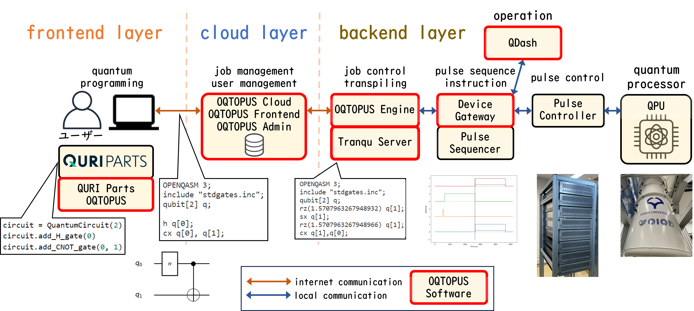

# OQTOPUS Engine

## Overview

**OQTOPUS Engine** in the backend layer retrieves jobs managed in OQTOPUS Cloud and executes quantum programs, working with **Tranqu Server**, providing the transpilers and **Device Gateway**, which serves as an interface for connecting to a pulse controller.
OQTOPUS Engine features **Server-Side Execution (SSE)**, **Multi-Programming**, **Error Mitigation**, **Estimation**, a **Transpiler** (utilizing Tranqu), and more.
OQTOPUS Engine is organized as a microservice architecture centered around the core process, which provides a job-processing framework (the pipeline).

## Usage

- [Getting Started](./usage/getting_started.md)

## Design

- [Overview](./design/overview.md)
- [Concept](./design/concept.md)
- [Dependency Injection](./design/di.md)
- [Pipeline Execution](./design/pipeline_execution.md)

## Developer Guidelines

- [Development Flow](./developer_guidelines/development_flow.md)
- [Setup Development Environment](./developer_guidelines/setup.md)
- [Implementing Pipeline](./developer_guidelines/implementing_pipeline.md)
- [How to Contribute](./CONTRIBUTING.md)
- [Code of Conduct](https://github.com/oqtopus-team/.github/blob/main/CODE_OF_CONDUCT.md)
- [Security](https://github.com/oqtopus-team/.github/blob/main/SECURITY.md)

## Citation

You can use the DOI to cite OQTOPUS Engine in your research.

Citation information is also available in the [CITATION](https://github.com/oqtopus-team/oqtopus-engine/blob/main/CITATION.cff) file.

## Contact

You can contact us by creating an issue in this repository or by email:

- [oqtopus-team[at]googlegroups.com](mailto:oqtopus-team[at]googlegroups.com)

## License

OQTOPUS Engine is released under the [Apache License 2.0](https://github.com/oqtopus-team/oqtopus-engine/blob/main/LICENSE).

## Supporting

This work was supported by JST COI-NEXT, Grant No. JPMJPF2014.
A part of this work was performed for Council for Science, Technology and Innovation (CSTI), Cross-ministerial Strategic Innovation Promotion Program (SIP), ‘Building and operation of a domestically developed quantum computer testbed environment’ (funding agency: QST).
