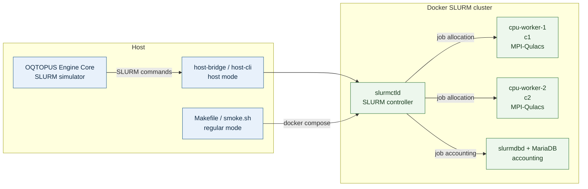

# Docker SLURM Fixture

This Engine-owned fixture runs a real SLURM controller, accounting daemon, and
scheduler workers in Docker. It validates the MPI-Qulacs runtime without using
the workspace-level Makefile.

The cluster registers two compute nodes (`c1` and `c2`) in the `cpu`
partition. The Docker-only launcher uses `mpirun` because the pinned image
exposes SLURM PMI-2 while its Rocky Linux OpenMPI package exposes PMIx. The
production launcher in `core/slurm_resources` remains unchanged and uses
`srun`.

## Architecture

The fixture has two connection modes. The regular mode is used by `smoke.sh`;
the host mode adds `compose.host.yaml` so Core can submit jobs from the host.
The diagram shows the runtime path; image-build details and individual volume
mounts are intentionally omitted.



In host mode, `host-bridge.sh` adds `compose.host.yaml` and preserves the same
absolute paths for the work root, launcher, and MPI-Qulacs worker on the host,
controller, and compute nodes.

`c1` and `c2` are separate Docker containers registered as separate SLURM
compute nodes. They simulate a two-node cluster, but both containers run on the
same Docker host; this fixture does not represent two physical machines.

## Commands

Run these commands from the Engine repository root:

```bash
make -C test-infra/scheduler/slurm build
make -C test-infra/scheduler/slurm up
make -C test-infra/scheduler/slurm smoke
make -C test-infra/scheduler/slurm down
```

The `smoke` target builds and starts the cluster before checking a four-rank
MPI probe across two nodes, sampling, direct estimation, accounting comments,
controller restart recovery, and cancellation. Named volumes are preserved by
`down`; use `down-volumes` when a clean accounting database is required.

To connect a host Core process to the cluster, start the host-visible variant
and source the fixture environment in Bash:

```bash
make -C test-infra/scheduler/slurm up-host
source test-infra/scheduler/slurm/host-engine.env
export SLURM_DEVICE_INFO="$(cat /tmp/qulacs-device-info.json)"
make -C core run-slurm-simulator
```

The host bridge derives `OQTOPUS_ENGINE_ROOT` from its own location and mounts
the work root, launcher, and worker at the same absolute paths in the
controller and compute nodes. Its `host-cli/` wrappers forward `sbatch`,
`squeue`, `sacct`, `sinfo`, `scontrol`, and `scancel` to the Docker controller.

Stop the host-visible variant with:

```bash
make -C test-infra/scheduler/slurm down-host
```

The image build uses the host network and passes `${OQTOPUS_BUILD_CA}` as a
BuildKit secret. It defaults to `/etc/ssl/certs/ca-certificates.crt`, allowing
a trusted local CA to be used without copying it into the image.

## Runtime architecture

The fixture currently targets `linux/amd64`. ARM64 image builds and ARM64
E2E validation are outside the scope of this change.

## Scope

This fixture validates scheduler commands, accounting, restart behavior, and
the actual Qulacs MPI worker across two Docker compute-node containers. It does
not validate a physical multi-node interconnect, site authentication, shared
cluster storage, queue policy, or production resource enforcement.
